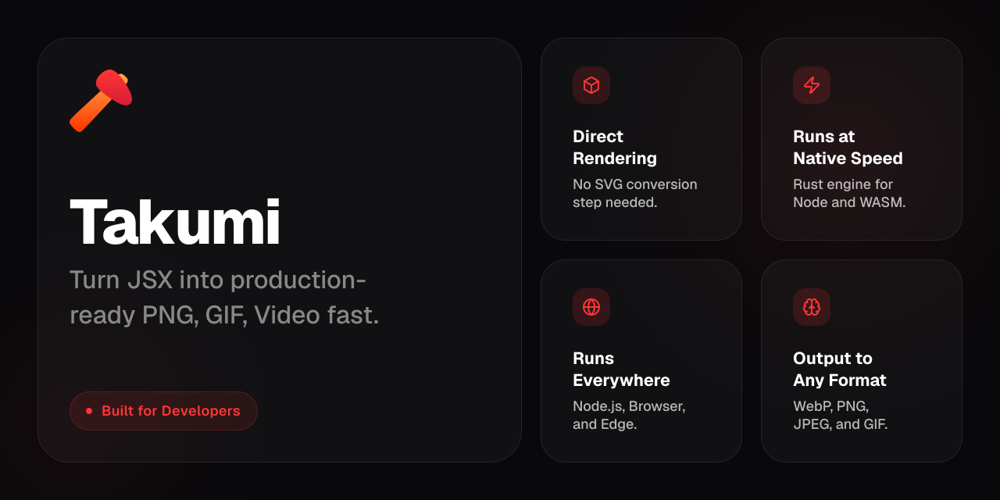
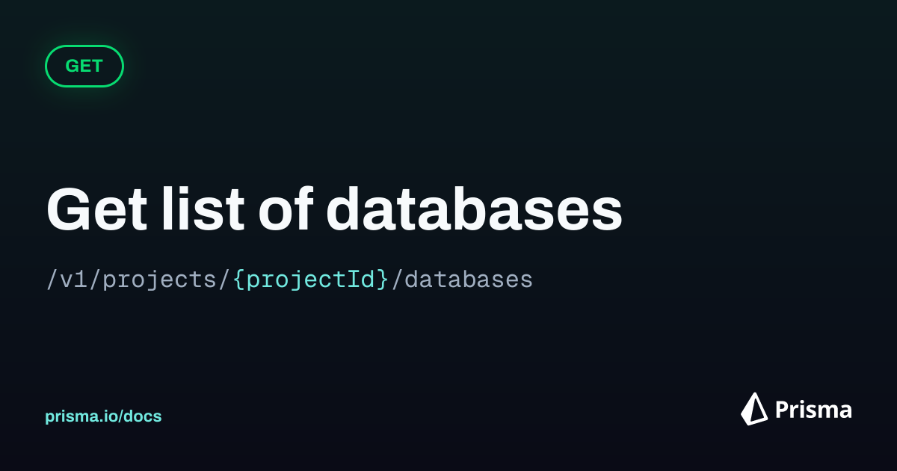
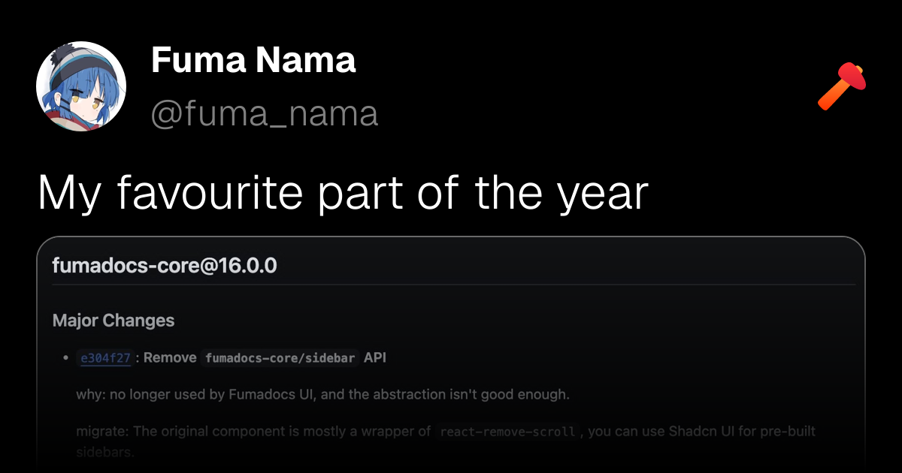

<div align="center">
  

# Takumi

**Turn JSX into production-ready images fast.**  
OG cards, banners, and lightweight animations from one Rust engine for Node.js and WebAssembly.

[Playground](https://takumi.kane.tw/playground) · [Docs](https://takumi.kane.tw/docs/) · [Image Bench](https://image-bench.kane.tw/) · [Star on GitHub](https://github.com/kane50613/takumi)

</div>

Takumi is inspired by [satori](https://github.com/vercel/satori), with a stronger focus on portability and performance.
In [Image Bench](https://image-bench.kane.tw/), Takumi is typically **2-10x faster** than `next/og`.

## Why pick Takumi

- One-pass rendering (no SVG-to-image two-step pipeline).
- Familiar JSX workflow with cross-runtime delivery.
- Node native bindings with WASM fallback for edge/browser workers.
- Production text support: variable fonts, COLR, WOFF2, and RTL.
- Rich visuals and animation output (WebP/APNG, FFmpeg pipelines).

## Quick start

```bash
npm i @takumi-rs/image-response
```

```tsx
/** @jsxImportSource react */
import { ImageResponse } from "@takumi-rs/image-response";

export function GET() {
  return new ImageResponse(
    <div tw="w-full h-full flex items-center justify-center bg-white">
      <h1 tw="text-6xl font-bold">Hello from Takumi</h1>
    </div>,
    {
      width: 1200,
      height: 630,
      format: "webp",
    },
  );
}
```

For runtime-specific setup (Next.js, Vite SSR, Nitro, Cloudflare, Turbopack), see [Docs](https://takumi.kane.tw/docs/).

## What you can build

- Open Graph and social cards
- Blog covers and marketing banners
- JSX-powered dynamic snapshots
- Component-based motion graphics

## Showcase

- Takumi OG image [(source)](./example/twitter-images/components/og-image.tsx)

  

- Prisma-style API card [(source)](./example/twitter-images/components/prisma-og-image.tsx)

  

- X-style social post [(source)](./example/twitter-images/components/x-post-image.tsx)

  

- [shiki-image](https://github.com/pi0/shiki-image): code snippet images

  

- [(Unofficial) Takumi Playground](https://takumi-playground.kapadiya.net/)

> [!NOTE]
> Showcase submissions are welcome via PR to [showcase.ts](./docs/app/data/showcase.ts).

## Contributing

PRs are welcome. See [CONTRIBUTING.md](./CONTRIBUTING.md) for setup, tests, fixtures, and changesets.
By participating, you agree to the [Code of Conduct](./CODE_OF_CONDUCT.md).

## Credits

Takumi builds on excellent OSS:
[taffy](https://github.com/DioxusLabs/taffy),
[image](https://github.com/image-rs/image),
[parley](https://github.com/linebender/parley),
[swash](https://github.com/linebender/swash),
[wuff](https://github.com/nicoburns/wuff),
[resvg](https://github.com/linebender/resvg).

## License

Licensed under either of:

- [Apache License, Version 2.0](./LICENSE-APACHE)
- [MIT license](./LICENSE-MIT)

<br/>
<a href="https://vercel.com/oss">
  
</a>
